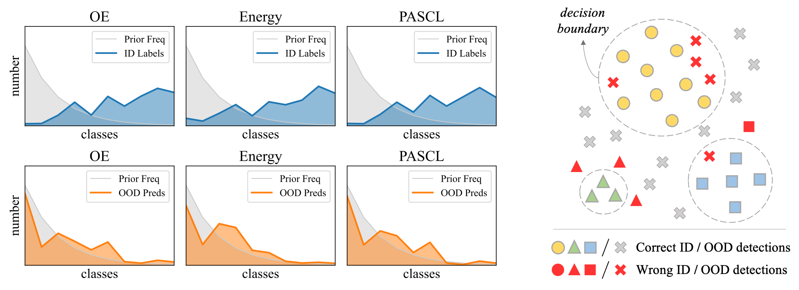

# ImOOD: Rethinking Out-of-Distribution Detection on Imbalanced Data Distribution

This is the official implementation of the [Rethinking Out-of-Distribution Detection on Imbalanced Data Distribution](https://www.arxiv.org/abs/2407.16430) paper.


<p align="center">

</p>

## Installation
This code is built on top of the [PASCL](https://github.com/amazon-science/long-tailed-ood-detection) framework, with a unified interface for customizing model designs and OOD metrics. Install the requirements and you are free to play with ImOOD.

```bash
cd path/to/imood
pip install -r requirements.txt
```

## Data Preparation

We suggest putting all datasets under the same folder (say `$DATA`, defauled as `./data`) to ease management and following the instructions below to organize datasets to avoid modifying the source code. 

<details>

<summary>CIFAR-LT benchmarks </summary>

<br>

**In-Distribution Data**: The default script `datasets/ImbalanceCIFAR.py` will automatically download the oringial `CIFAR10/100` datasets through `torchvision`, and prepare the long-tailed version of `CIFAR10/100-LT` as the imbalanced ID data.

**Out-of-Distribution Test Data**: Download the [SCOOD](https://drive.google.com/file/d/1cbLXZ39xnJjxXnDM7g2KODHIjE0Qj4gu/view?usp=sharing) test data and put it into `$DATA/SCOOD/data/`.

**Out-of-Distribution Auxilliary Data**: Download the [300K_random_images.npy](https://people.eecs.berkeley.edu/~hendrycks/300K_random_images.npy) and put it into `$DATA/tinyimages80m/300K_random_images.npy` (you should create the folder ahead).

The file structure looks like

```
$DATA/
|–– cifar-10-batches-py/
|–– cifar-100-python/
|–– SCOOD/data/
|–– tinyimages80M/
|–– cifar-10-python.tar.gz
|–– cifar-100-python.tar.gz
```
</details>

<details>

<summary>ImageNet-LT benchmark (Optional)</summary>

<br>

**In-Distribution Data**: Create a folder named `imagenet/` under `$DATA`, download the dataset from the [official website](https://image-net.org/index.php), and extract the training and validation sets to `$DATA/imagenet/`. The default script `datasets/ImbalanceImageNet.py` will automatically prepare the long-tailed version of `ImageNet-LT` as the imbalanced ID data.

**Out-of-Distribution Auxilliary/Test Data**: Execute the `datasets/ImageNet_LT/get_imagenet10k.sh` script and it will automatically download the whole [ImageNet-10K](https://image-net.org/index.php) dataset and extract the auxilliary/test OOD data for the ImageNet-LT benchmark to train or test. **Note**: it requires 700*2=1,400 GB  storage and cost some time to download.

The file structure looks like

```
$DATA/
|–– imagenet/
    |–– train/
    |–– val/
    |–– extra_1k/
    |–– ood_test_1k/
```
</details>

<br>

If you have some datasets already installed somewhere else, you can create symbolic links in `$DATA/dataset_name` that point to the original data to avoid duplicate download.


## ImOOD: Training-time Regularization

### Training

This repo provide a unified interface to train a OOD detector with the metric options mentioned above.
Here are some examples to train a OOD detector on CIFAR10/100-LT and ImageNet-LT benchmarks.

* CIFAR10/100-LT
```bash
python train.py --gpu 0 --ds cifar10 --e 180 \
    --drp data --srp runs \
    --imbalance_ratio .01 --logit_adjust 1.0 \
    --ood_metric ada_bin_disc \
    --Lambda 0.5 --Lambda2 0.05  --aux_ood_loss pascl 
```

* ImageNet-LT:
```bash
python train.py --gpu 0,1 --ds imagenet --md ResNet50 -e 100 --opt sgd --decay multisteps --lr 0.1 --wd 5e-5 -b 192 --tb 100 \
    --ddp --dist_url tcp://localhost:23457 \
    --drp data --srp srp \
    --imbalance_ratio .01 --logit_adjust 1.0  \
    --ood_metric ada_bin_disc \
    --Lambda 0.5 --Lambda2 0.05 --aux_ood_loss pascl
```

You can change `--ds` to swith on benchmarks (with different base models), and try on various OOD detectors by setting `--ood_metric` as `ada_oe` ([OE](https://github.com/hendrycks/outlier-exposure)), `ada_energy` ([Energy](https://github.com/wetliu/energy_ood)), `ada_bin_disc` ([BinDisc](https://github.com/j-cb/Breaking_Down_OOD_Detection)), and `ada_maha` ([Maha](https://github.com/pokaxpoka/deep_Mahalanobis_detector)). The detailed parameter descriptions ar as follows.


<details>

<summary>Parameter description </summary>

<br>

- `--gpu`: GPU device ID, where `0` indicates GPU 0 and `0,1` means GPU 0 and GPU 1 will be used together.
- `--ds` or `--dataset`: dataset name, which can be `cifar10`, `cifar100`, and `imagenet`.
- `--drp` or `--data_root_path` and `--srp` or `--save_root_path` determine the data or save paths.
- `--imbalance_ratio`: imbalance ratio for the ID dataset, `0.01` as default.
- `--logit_adjust`: scale factor for [logit adjustment](https://github.com/Chumsy0725/logit-adj-pytorch), `1.0` as default, and `0.0` means adjustment is not applied.
- `--ood_metric`: the metric to train the OOD detector, which can be `ada_oe`, `ada_energy`, `ada_bin_disc`, and `ada_maha`, as well as the vanilla version of `oe`, `energy`, `bin_disc`, and `maha` for comparison.
- `--Lambda` and `--Lambda2` determine the scaling factors for the primary loss (i.e., `ada_bin_disc`) and the auxilliary loss (i.e., `pascl`) for the OOD detection branch. `--aux_ood_loss` determines the auxilliary loss function, where `pascl` ([PASCL](https://github.com/amazon-science/long-tailed-ood-detection)) and `simclr` ([SimCLR](https://github.com/google-research/simclr)) are supported.
- `--md`, `-e`, `--opt`, `--decay`, `--lr`, `--wd`, `-b`, `--tb`: hyper-parameters to train the base model (`ResNet18/ResNet50` for `cifar/imagenet` as default), and the details are displayed in `train.py`.

</details>


### Testing

After training the OOD detectors with the commands provided above, you will obtain a better detector approaching the ideal balanced OOD detector on the imbalanced ID data distribution.
Under this circumstance, the post-hoc normalization technique is not needed, and just test the detectors as usual.

* CIFAR10/100-LT
```bash
python test.py --gpu 0 --ds cifar10 --model ResNet18 \
    --drp data --ood_metric bin_disc \
    --ckpt_path weights/cifar10/ada_bin_disc
```

* ImageNet-LT
```bash
python test.py --gpu 0 --ds imagenet --model ResNet50 --tb 200 \
    --drp data --ood_metric bin_disc \
    --ckpt_path weights/imagenet/ada_bin_disc
```


## ImOOD: Post-hoc Normalization

Assume you have got a baseline model trained on imbalanced ID data with whatever OOD metrics like OE, Energy, BinDisc (by using our commands for example), put them into the `weights/baseline` and run the following code to perform our post-hoc normalization technique for a cost-free improvement:

* CIFAR10/100-LT
```bash
python test.py --gpu 0 --ds cifar10 --model ResNet18 \
    --drp data --ood_metric ada_energy \
    --logit_adjust 1.0 \
    --ckpt_path weights/baseline/cifar10/energy
```

* ImageNet-LT
```bash
python test.py --gpu 0 --ds imagenet --model ResNet50 --tb 200 \
    --drp data --ood_metric ada_energy \
    --logit_adjust 1.0 \
    --ckpt_path weights/baseline/imagenet/energy
```

You can easily adjust the `ood_metric` parameter according to the OOD metric that the baseline model is trained with. 
In this case, the prefix `ada_` indicates using our post-hoc nomarlization, and the suffix `energy` refers to the specific OOD metric.

This repo temporally supports various adaptive inference metrics: `ada_msp` ([OE](https://github.com/hendrycks/outlier-exposure)/[MSP](https://github.com/hendrycks/error-detection)), `ada_energy` ([Energy](https://github.com/wetliu/energy_ood)), `ada_bin_disc` ([BinDisc](https://github.com/j-cb/Breaking_Down_OOD_Detection)), `ada_maha` ([Maha](https://github.com/pokaxpoka/deep_Mahalanobis_detector)), and `ada_gradnorm` ([GradNorm](https://github.com/brianlan/pytorch-grad-norm)). 

The implementation details can be found in `models/base.py`.


## Released models
- [ ] We are working on it. Please stay tuned.


## Citation
If you find this repo or paper useful in your research, please kindly star this repo and cite this paper:

```
@article{liu2024imood,
      title={Rethinking Out-of-Distribution Detection on Imbalanced Data Distribution}, 
      author={Liu, Kai and Fu, Zhihang and Jin, Sheng and Chen, Chao and Chen, Ze and Jiang, Rongxin and Zhou, Fan and Chen, Yaowu and Ye, Jieping},
      journal={Advances in Neural Information Processing Systems},
      volume={38},
      year={2024}
}
```